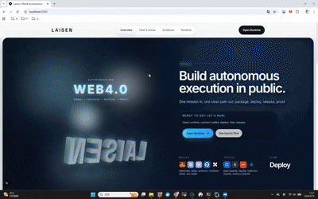

# Laisen

Laisen is a `Web4 Autonomous Execution Engine`.

It is not a DAO platform, not a governance dashboard, and not a multi-page SaaS admin system.

Its single job is to make one story immediately legible in a live demo:

`Intent -> AI Protocol Package -> Wallet Connect -> Base Sepolia Deploy -> Signal Intake -> AI Decision -> DAO Propose / Vote / Queue / Execute -> Onchain Proof`



The current codebase has two layers:

- a calm, public-facing protocol website
- a standalone runtime page at `/runtime`

The runtime itself remains built for hackathon judges:

- `AI` is the active operator
- `Human` is wallet-gated release and override-only
- `Execution` is the center of the stage
- `Wallet`, `chain`, `deployment`, `tool calls`, `schema`, `fallback`, and `proof` stay visible

## Product Layers

### Public website

The public surface is intentionally restrained:

- `/` explains what Laisen is in one pass
- `/how-it-works` explains the runtime sequence
- `/evidence` explains sponsor-visible proof and fallback behavior
- `/runtime` presents the live runtime as a second-level website page

The public surface is not a product dashboard. It exists to orient a first-time visitor quickly, then send them to the runtime without changing product language.

### Runtime demo

The runtime stays intentionally singular:

- standalone route at `/runtime`
- fallback legacy route at `/arena` redirects to `/runtime`
- same site shell, typography, spacing rhythm, and surface system as the rest of the website
- live runtime behavior powered by the existing machine and service layer
- real wallet flow powered by `wagmi + viem`
- Base Sepolia as the primary testnet
- minimal onchain package:
  - `LaisenGovernanceToken`
  - `LaisenGovernor`
  - `LaisenTimelock`
  - `LaisenRuntimeProtocol`

No CRUD back office, governance center, or multi-page SaaS admin surface is part of the product.

## Tech Stack

- `Next.js` App Router
- `React`
- `TypeScript`
- `Tailwind CSS`
- `XState`
- `Zod`
- `wagmi`
- `viem`
- `OpenZeppelin`
- `solc`

## Project Structure

```text
src/
├── app/
│   ├── globals.css
│   ├── layout.tsx
│   ├── providers.tsx
│   ├── arena/
│   │   └── page.tsx
│   ├── runtime/
│   │   ├── layout.tsx
│   │   └── page.tsx
│   └── (marketing)/
│       ├── layout.tsx
│       ├── page.tsx
│       ├── evidence/
│       │   └── page.tsx
│       └── how-it-works/
│           └── page.tsx
├── contracts/
│   ├── LaisenGovernanceToken.sol
│   └── LaisenRuntimeProtocol.sol
├── components/
│   └── ui/
│       ├── panel.tsx
│       └── status-badge.tsx
├── features/
│   ├── onchain/
│   │   ├── config/
│   │   │   ├── chains.ts
│   │   │   └── wagmi-config.ts
│   │   ├── contracts/
│   │   │   └── generated.ts
│   │   ├── hooks/
│   │   │   └── use-runtime-onchain.ts
│   │   ├── schema/
│   │   │   └── onchain-schema.ts
│   │   ├── services/
│   │   │   ├── generate-protocol-package.ts
│   │   │   └── runtime-protocol-service.ts
│   │   └── utils/
│   │       └── hash.ts
│   ├── site/
│   │   └── components/
│   │       ├── hero-visual.tsx
│   │       ├── runtime-preview.tsx
│   │       ├── section-heading.tsx
│   │       ├── site-footer.tsx
│   │       ├── site-header.tsx
│   │       └── site-shell.tsx
│   ├── runtime-site/
│   │   └── components/
│   │       ├── runtime-live-stage.tsx
│   │       └── runtime-page-client.tsx
│   └── runtime/
│       ├── data/
│       │   ├── demo-presets.ts
│       │   ├── demo-scenarios.ts
│       │   └── runtime-profiles.ts
│       ├── machine/
│       │   └── runtime-machine.ts
│       ├── schema/
│       │   └── runtime-schema.ts
│       └── services/
│           ├── decision-service.ts
│           ├── evidence-service.ts
│           ├── execution-service.ts
│           ├── founder-service.ts
│           ├── mock-runtime-services.ts
│           └── signal-service.ts
└── lib/
    └── utils.ts
```

## Environment Variables

Minimal `.env.local` for DAO runtime:

```bash
NEXT_PUBLIC_LAISEN_CHAIN_ID=84532
NEXT_PUBLIC_LAISEN_CONTRIBUTOR_ADDRESS=
NEXT_PUBLIC_LAISEN_COMMUNITY_ADDRESS=
```

Optional live AI planning (for `/api/runtime/ai-plan`):

```bash
GMI_API_URL=
GMI_API_KEY=
GMI_MODEL=zai-org/GLM-5-FP8
```

If `GMI_API_URL` or `GMI_API_KEY` is missing, the API route falls back to deterministic local planning and still returns a deployable package.

Runtime profile behavior:

- `Judge Path` supports a real wallet and Base Sepolia happy path
- `Demo Safe` simulates cached fallback
- `Failure Drill` simulates visible hard failure
- if wallet / RPC / network fails, the runtime can still continue in explicit offchain-safe mode

Future sponsor adapters can be added behind the existing service boundary without changing the single-screen runtime.

## Install

```bash
pnpm install
pnpm contracts:compile
```

## Local Development

```bash
pnpm dev
```

Key routes:

- `http://localhost:3000/`
- `http://localhost:3000/how-it-works`
- `http://localhost:3000/evidence`
- `http://localhost:3000/runtime`
- `http://localhost:3000/arena`

## Production Demo Build

```bash
pnpm demo
```

Or run manually:

```bash
pnpm build
pnpm start
```

## Validation

Run the full local gate before demo day:

```bash
pnpm check
```

This runs:

- `eslint`
- `tsc --noEmit`
- `next build`

## Demo Presets

The app ships with three operator-ready presets.

### 1. Judge Path

Use this first.

- Profile: `Live Path`
- Goal: show the cleanest sponsor-visible execution story with real MetaMask + Base Sepolia deployment
- Expected outcome: connected wallet, deployed token + runtime protocol, validated schema, live signal, approved execution, visible proof

### 2. Demo Safe

Use this when the venue is unstable.

- Profile: `Demo Safe`
- Goal: prove Laisen stays operational even when live infrastructure degrades
- Expected outcome: cached signal, fallback evidence, uninterrupted runtime story

### 3. Failure Drill

Use this only if you need to prove resilience.

- Profile: `Failure Drill`
- Goal: show that failure is surfaced clearly instead of hidden
- Expected outcome: hard-stop evidence, failed schema state, visible proof trail

## Recommended Judge Script

### Golden Demo Path

1. Open `/runtime` and keep the default preset on `Judge Path`.
2. Say: `Human provides the mission. AI generates the protocol package. The wallet only releases execution.`
3. Connect MetaMask.
4. Switch to Base Sepolia if required.
5. Click `Deploy Protocol Package`.
6. Point to:
   - wallet address
   - chain
   - deployment tx hash
   - token address
   - protocol address
7. Click `Launch Runtime`.
8. Let judges see:
   - founder spawn
   - signal intake
   - AI decision
   - wallet-gated mandate release
9. Click `Approve` or `Reject`.
10. Point to the right rail:
   - provider
   - model
   - tool calls
   - schema status
   - fallback status
   - proposal tx hash
   - action tx hash
11. Point to the proof ledger:
   - deployment event
   - runtime events
   - governor propose/vote/queue/execute events
12. During execution, optionally trigger `Override` to prove secondary human interruption.

### Demo Safe Path

1. Switch to `Demo Safe`.
2. Start runtime.
3. Call out that the runtime preserved continuity through cached evidence.
4. Show:
   - fallback mode visible
   - schema fallback visible
   - execution still proceeds

### Failure Drill Path

1. Switch to `Failure Drill`.
2. Start runtime.
3. Show that the runtime fails visibly during signal intake.
4. Point to:
   - failed schema state
   - failed tool call
   - hard-fail marker
   - proof event in the timeline

## Runtime States

Primary lane:

- `idle`
- `founder_spawn`
- `signal_intake`
- `ai_decision`
- `autonomous_execution`
- `execution_completed`

Override lane:

- `override_requested`
- `override_active`
- `resumed_execution`
- `redirected_execution`
- `aborted_execution`

Resilience lane:

- `safe_mode_adapting`
- `hard_fail`

## Competition Notes

- Use the homepage for orientation, then open `/runtime` for the live walkthrough.
- Keep `/arena` as the hidden fallback route if you need a legacy entry point.
- Start with `Judge Path`.
- Only use `Demo Safe` if network or inference conditions are shaky.
- Only use `Failure Drill` if you need to prove resilience under failure.
- Human should be narrated as `override`, never as the primary operator.

## Current Strengths

- Public shell is calm and readable for first-time visitors
- Runtime is clearly separated into a real second-level page
- Runtime page still feels like the same site rather than a different application
- Live runtime surface is easy to understand in under two minutes
- AI-first control flow, not approval-first workflow
- Visible sponsor evidence
- Deterministic demo-safe fallback
- Strong separation between runtime state, services, and UI

## Current Known Risks

- The override window should be rehearsed once manually before the live pitch to match speaking pace.
- DAO flow now runs onchain and includes voting + timelock delay, so demo timing is slower than direct owner execution.
- This build is optimized for demo clarity, not for production authentication, persistence, or multi-user collaboration.
